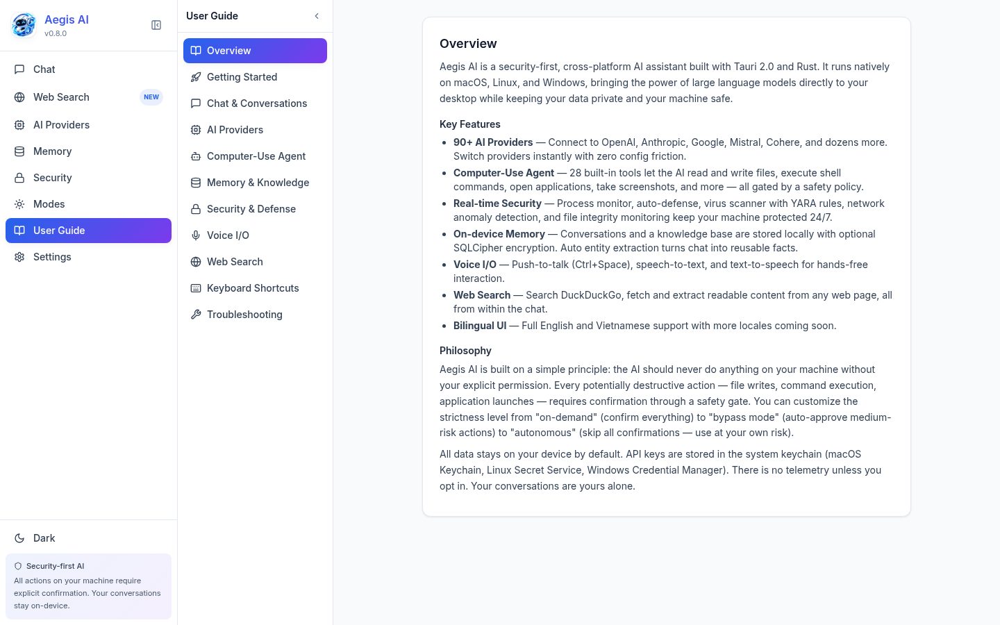
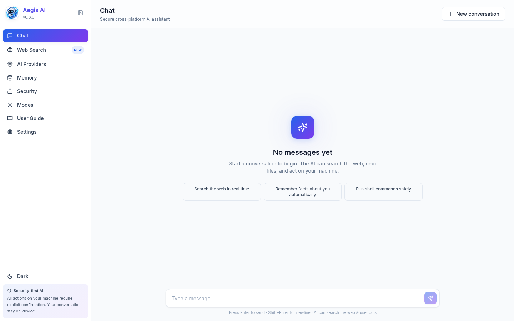

<div align="center">
  
</div>

# Aegis AI

**Secure cross-platform AI assistant with computer-use, persistent memory, world intelligence, and built-in auto-defense.**

[](LICENSE)
[](https://www.rust-lang.org)
[](https://tauri.app)
[](https://github.com/hieulouisdev/Axiom/releases)
[](https://github.com/hieulouisdev/Axiom)
[](https://github.com/hieulouisdev/Axiom)
</div>

---

## Screenshots

<p align="center">
  
  &nbsp;&nbsp;
  
</p>

---

## Overview

Aegis AI is a desktop application (Linux + Windows) **and a standalone CLI** that connects to **90+ AI providers** with a unified catalog of **10,978 models** — zero-config built-in (Z.AI GLM-4.6), cloud (OpenAI, Anthropic, Gemini, DeepSeek, Groq, Mistral, xAI, Perplexity, Cerebras, NVIDIA, …), local (Ollama, LM Studio, llama.cpp, GPT4All, vLLM, …), and custom endpoints.

Beyond chat, Aegis AI can **act on your computer** — open apps, read/write files, run shell commands, automate the GUI, capture the screen — all gated by a 5-level safety policy with an irrevocable hard-deny list.

### What's New in v1.7.0 — Singularity II

This is the largest single drop in Aegis AI history. Five new subsystems ship together, inspired by [TencentDB-Agent-Memory](https://github.com/TencentCloud/TencentDB-Agent-Memory) and [worldmonitor](https://github.com/koala73/worldmonitor):

1. **Hierarchical Memory (L0→L3)** — Conversations are distilled layer-by-layer into Atoms (L1), Scenarios (L2), and Persona traits (L3), exactly mirroring TencentDB-Agent-Memory's model. Includes deterministic + LLM-assisted atom extraction.
2. **Versioned Skill Library** — Skills are no longer a hardcoded enum. Draft → Review → Published → Deprecated lifecycle, with versioned system prompts, trigger keywords, and execution steps.
3. **Wiki Knowledge Base** — Structured pages with a bidirectional link graph. Inspired by TencentDB-Agent-Memory's Wiki layer.
4. **CodeGraph** — Indexes code symbols (functions, structs, traits, modules) across Rust / TypeScript / Python / Go / JavaScript, with caller/callee edges for impact analysis.
5. **World Intelligence** — Real-time news from 20+ curated RSS feeds (Reuters, BBC, Al Jazeera, NYT, Hacker News, Krebs on Security, USGS earthquakes, …), market data (CoinGecko + ECB FX + Stooq stocks), and a Country Instability Index (CII v8-style scorer).
6. **MCP Server** — JSON-RPC over stdio, so external agents (Claude Code, Cursor, Codex) can call Aegis AI's memory, skills, wiki, world, and code-graph tools directly. 9 tools shipped.
7. **Aegis CLI** — A brand-new standalone binary (`aegis`) with a beautiful TUI built on `ratatui` + `crossterm`. Cross-platform: Linux, Windows, macOS, and Android (via Termux).

---

## Key Features

| Category | Details |
|---|---|
| **90+ Providers** | Uniform `Provider` trait; switch with one click |
| **10,978 Models** | Unified catalog with context window, modalities, pricing |
| **28 Agent Tools** | Shell, file I/O, app launch, screenshot, GUI automation, clipboard, git, http_fetch, code_eval, memory, skill_set, … |
| **15 Builtin Skills** | Code writer, reviewer, debugger, architect, security auditor, sysadmin, researcher, translator, … |
| **Hierarchical Memory** | L0 Conversations → L1 Atoms → L2 Scenarios → L3 Persona |
| **Skill Library** | Versioned, with draft/review/published/deprecated lifecycle |
| **Wiki Knowledge Base** | Pages + tags + bidirectional link graph |
| **CodeGraph** | Symbol indexing + caller/callee edges (Rust/TS/Py/Go/JS) |
| **World Intelligence** | News (20+ feeds), markets (CoinGecko/ECB/Stooq), CII risk scoring |
| **MCP Server** | 9 tools accessible from Claude Code, Cursor, Codex, etc. |
| **RAG / Memory** | Vector-embedding knowledge base, semantic search, persistent SQLite storage |
| **Voice I/O** | Push-to-talk (Ctrl+Space), cloud Whisper STT, OS-native + ElevenLabs TTS |
| **3 Safety Layers** | Kill switch, rate limiter (30/min), audit log — every action recorded |
| **Auto-Defense** | Passive process monitor → threat detection → quarantine + kill |
| **Bypass Mode** | Skip confirmations for Medium/High (hard-deny list always enforced) |
| **7 Languages** | EN, VI, ES, FR, DE, JA, ZH-CN — switchable at any time |
| **Privacy First** | Zero telemetry, no cloud sync, API keys in OS keychain |
| **Fast-Path HTTP** | LRU cache + dedup layer → first-token latency < 400ms on warm calls |
| **Beautiful CLI** | `ratatui` TUI with chat, memory, world, skills, settings panels |

---

## Downloads

### Desktop App (GUI)

Download pre-built installers from the [latest release](https://github.com/hieulouisdev/Axiom/releases/latest):

| Platform | Installer |
|---|---|
| Windows x64 | `Aegis-AI_1.7.0_x64-setup.exe` (NSIS) or `Aegis-AI_1.7.0_x64_en-US.msi` |
| Linux x64 | `aegis-ai_1.7.0_amd64.deb` or `aegis-ai_1.7.0_amd64.AppImage` |

### CLI (Cross-Platform)

The CLI is a single-file binary — no installer needed. Download the right one for your platform from the [latest release](https://github.com/hieulouisdev/Axiom/releases/latest):

| Platform | Binary |
|---|---|
| Linux x64 | `aegis-v1.7.0-x86_64-linux` |
| Linux ARM64 (Raspberry Pi 4/5, Termux root) | `aegis-v1.7.0-aarch64-linux` |
| Linux ARMv7 (older Raspberry Pi, Termux root) | `aegis-v1.7.0-armv7-linux` |
| Windows x64 | `aegis-v1.7.0-x86_64-windows.exe` |
| macOS Intel | `aegis-v1.7.0-x86_64-macos` |
| macOS Apple Silicon | `aegis-v1.7.0-aarch64-macos` |

#### Install on a computer (Linux/macOS/Windows)

**Linux / macOS** (terminal):
```bash
# Linux x64 example — change the URL for your platform
curl -L -o aegis https://github.com/hieulouisdev/Axiom/releases/latest/download/aegis-v1.7.0-x86_64-linux
chmod +x aegis
sudo mv aegis /usr/local/bin/   # optional — to put it on PATH
aegis version
```

**macOS Apple Silicon**:
```bash
curl -L -o aegis https://github.com/hieulouisdev/Axiom/releases/latest/download/aegis-v1.7.0-aarch64-macos
chmod +x aegis
sudo xattr -dr com.apple.quarantine aegis   # remove Gatekeeper warning
sudo mv aegis /usr/local/bin/
aegis version
```

**Windows** (PowerShell as admin):
```powershell
Invoke-WebRequest -Uri "https://github.com/hieulouisdev/Axiom/releases/latest/download/aegis-v1.7.0-x86_64-windows.exe" -OutFile "aegis.exe"
Move-Item aegis.exe "C:\Windows\System32\aegis.exe"
aegis version
```

#### Install on Android (via Termux — no root needed)

Aegis AI CLI runs on Android phones through **Termux**:

1. Install [Termux](https://f-droid.org/packages/com.termux/) from F-Droid (the Play Store version is outdated).
2. Open Termux and run:
   ```bash
   # Most phones today are ARM64 — use the aarch64 binary
   curl -L -o aegis https://github.com/hieulouisdev/Axiom/releases/latest/download/aegis-v1.7.0-aarch64-linux
   chmod +x aegis
   mv aegis ~/usr/bin/aegis    # or ~/.local/bin/aegis if you prefer
   aegis version
   ```
3. Try it:
   ```bash
   aegis chat "what's the weather like in Hanoi?"   # one-shot
   aegis                                            # interactive TUI
   ```
4. To make `aegis` available system-wide (optional, requires `termux-setup-storage`):
   ```bash
   termux-setup-storage
   echo 'export PATH=$PATH:~/usr/bin' >> ~/.bashrc
   source ~/.bashrc
   ```

> **Tip**: Z.AI GLM-4.6 works with **no API key** by default, so you can chat immediately after install. To use OpenAI / Anthropic / Gemini / DeepSeek / OpenRouter, run `aegis configure <provider> --key <KEY>`.

#### Install via cargo (build from source)

If you have Rust 1.97.1+ installed:
```bash
git clone https://github.com/hieulouisdev/Axiom.git
cd Axiom
cargo build --release -p aegis-cli
# binary is at target/release/aegis
```

---

## Quick Start

### CLI (recommended for first-time users)

```bash
aegis                    # launch the interactive TUI
aegis chat "explain async rust"          # one-shot question
aegis providers          # list configured providers
aegis configure openai --key sk-...      # add an API key
aegis memory atoms      # see what Aegis remembers about you
aegis world news        # latest world news
aegis world snapshot    # market snapshot
aegis code register ./my-repo --language rust   # index a codebase
aegis mcp               # run the MCP server (for Claude Code, Cursor, etc.)
```

### Desktop App (full GUI)

#### Prerequisites

- **Rust 1.97.1** (pinned via `rust-toolchain.toml`)
- **Node.js 20+** and npm
- **Tauri 2 system deps**:
  - Linux: `libwebkit2gtk-4.1-dev libgtk-3-dev librsvg2-dev libssl-dev patchelf`
  - Windows: WebView2 runtime (pre-installed on Windows 11)

#### Build & Run

```bash
git clone https://github.com/hieulouisdev/Axiom.git
cd Axiom
npm install
npm run tauri:dev      # dev window with hot reload
npm run tauri:build    # release bundle → src-tauri/target/release/bundle/
```

---

## Usage

### CLI Modes

1. **Interactive TUI** (`aegis`) — five panels:
   - **Chat** — conversation with auto memory extraction
   - **Memory** — browse atoms / scenarios / persona
   - **World** — news + markets + risk (press `r` to refresh)
   - **Skills** — versioned skill library
   - **Settings** — provider config + version info
   - Press `Tab` to switch panels, `Esc` or `q` to quit.

2. **One-shot** (`aegis chat "..."`) — single query, print answer, exit. Great for shell scripts. Use `--json` for machine-readable output.

### Desktop Usage

1. **Add a provider** — AI Providers → Configure → enter API key → Test → Set as active
2. **Pick a mode** — Modes → Continuous (always on) or On-demand (cheapest)
3. **Chat** — Type a message → Enter. AI can chain tools via function-calling
4. **Review security** — Security panel: monitor status, threats, quarantine
5. **Memory** — Browse conversations, knowledge base, activity log

---

## Project Structure

```
aegis-ai/
├── src-tauri/src/          # Rust backend (desktop app)
│   ├── ai/                 # Provider trait + 90+ provider impls + orchestrator
│   ├── computer/           # Apps, files, commands, automation, safety
│   ├── security/           # Monitor, network, scanner, defender, quarantine
│   ├── memory/             # SQLite: conversations, atoms, scenarios, persona,
│   │                       #   knowledge, embeddings, graph, wiki, codegraph
│   ├── world/              # News (RSS), finance (CoinGecko/ECB/Stooq), CII
│   ├── mcp/                # MCP server (JSON-RPC over stdio) + 9 tools
│   ├── modes/              # Continuous / on-demand
│   ├── workflow/           # Declarative workflow engine
│   ├── intelligence/       # Proactive pattern detection
│   ├── tasks/              # Background task queue
│   └── i18n/               # 7-locale translation tables
├── cli/src/                # Aegis CLI (standalone binary)
│   ├── ai/                 # 7 providers: openai, anthropic, gemini, deepseek,
│   │                       #   zai (GLM-4.6 zero-key), ollama, openrouter
│   ├── memory/             # Same hierarchy/skills/wiki/codegraph model
│   ├── world/              # Same news/finance/geopolitics modules
│   ├── mcp/                # Same MCP server
│   ├── tui/                # ratatui + crossterm interface
│   └── commands/           # chat, memory, skills, wiki, world, code, mcp
├── src/                    # React frontend (TypeScript + Tailwind)
└── docs/                   # Architecture, providers, safety, ADRs, user guide
```

---

## Configuration

### CLI

Config stored at:
- Linux: `~/.local/share/aegis-ai/config.toml`
- macOS: `~/Library/Application Support/aegis-ai/config.toml`
- Windows: `%APPDATA%\aegis-ai\config.toml`

```toml
active_provider = "zai"
default_model = "glm-4.6"
persona_user_id = "default"

[providers.zai]
base_url = "https://api.z.ai/api/paas/v4"
default_model = "glm-4.6"

[providers.openai]
api_key = "sk-..."
default_model = "gpt-4o-mini"

[providers.anthropic]
api_key = "sk-ant-..."
default_model = "claude-3-5-sonnet-latest"
```

### Desktop App

Config stored at `~/.local/share/aegis-ai/config.toml` (Linux) or `%APPDATA%\aegis-ai\config.toml` (Windows):

```toml
schema_version = 1
language = "en"              # en | vi | es | fr | de | ja | zh-CN
mode = "ondemand"            # ondemand | continuous

[security]
auto_defense = true
monitor = true
scanner_enabled = true

[memory]
max_conversations = 1000
enable_summarization = true
```

---

## MCP Integration

Aegis AI ships with a built-in MCP server. Point your MCP-compatible client at it:

### Claude Desktop

Add to `claude_desktop_config.json`:
```json
{
  "mcpServers": {
    "aegis-ai": {
      "command": "aegis",
      "args": ["mcp"]
    }
  }
}
```

### Cursor

Add to `~/.cursor/mcp.json`:
```json
{
  "mcpServers": {
    "aegis-ai": {
      "command": "aegis",
      "args": ["mcp"]
    }
  }
}
```

### Available MCP Tools

| Tool | Description |
|---|---|
| `memory_search` | Search Aegis AI's persistent memory store |
| `memory_remember` | Persist a durable fact |
| `skills_match` | Find published skills whose triggers match a message |
| `world_news` | Fetch latest news briefs |
| `world_finance` | Fetch market quotes |
| `world_risk` | Compute country instability index |
| `wiki_search` | Search the local Wiki knowledge base |
| `codegraph_search` | Search indexed code symbols by name |
| `graph_query` | Query the knowledge graph by (subject, predicate, object) pattern |

---

## Documentation

| Document | Description |
|---|---|
| [Roadmap](ROADMAP.md) | 4-phase development plan |
| [Changelog](CHANGELOG.md) | Version history |
| [Contributing](CONTRIBUTING.md) | How to contribute |
| [Privacy Policy](PRIVACY.md) | Data handling & privacy |
| [Security Policy](SECURITY.md) | Vulnerability reporting |
| [Architecture](docs/ARCHITECTURE.md) | Module layout & data flow |
| [Providers Guide](docs/PROVIDERS.md) | Adding a new AI provider |
| [Safety Policy](docs/SAFETY.md) | How safety classification works |
| [Developer Guide](docs/developer-guide.md) | Setup, testing, debugging |
| [Security Whitepaper](docs/security-whitepaper.md) | Full security analysis |
| [Threat Model](docs/threat-model.md) | Attack trees & mitigations |

---

## Built With

- [Tauri 2.0](https://tauri.app) — cross-platform desktop runtime
- [Rust 1.97.1](https://www.rust-lang.org) — backend + CLI
- [React 18](https://react.dev) + [TypeScript](https://www.typescriptlang.org) + [Tailwind CSS](https://tailwindcss.com) — desktop frontend
- [ratatui](https://ratatui.rs) + [crossterm](https://github.com/crossterm-rs/crossterm) — CLI TUI
- [rusqlite](https://github.com/rusqlite/rusqlite) — embedded SQLite
- [reqwest](https://github.com/seanmonstar/reqwest) — HTTP client
- [clap](https://docs.rs/clap) — CLI argument parser
- [Lucide](https://lucide.dev) — icon set

---

## Acknowledgements

v1.7.0's new subsystems were inspired by two open-source projects:

- **[TencentDB-Agent-Memory](https://github.com/TencentCloud/TencentDB-Agent-Memory)** — hierarchical memory (L0→L3), skill library, wiki, and code graph concepts.
- **[worldmonitor](https://github.com/koala73/worldmonitor)** — world intelligence aggregation, news feeds, market data, and country instability index.

Both are credited in the corresponding module docs.

---

## License

MIT — see [LICENSE](LICENSE).
